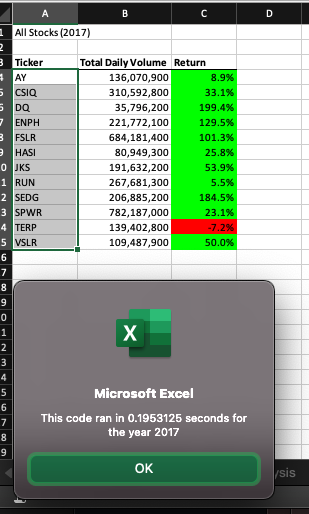

# Stock-Analysis

## 1. Overview of Project: Explain the purpose of this analysis.

### The purpose of this project is to help Steve's parents to analysis the green energy stocks, to get a summary of stocks' performance per year. In this way, Steve's parents could see all stocks return rate and total volume in one sheet. This could help Steve's parents to decide which stock they want to invest. We also add color (green and red) based on stock's return rate for an easy visualization. 

## 2. Results: Using images and examples of your code, compare the stock performance between 2017 and 2018, as well as the execution times of the original script and the refactored script.

### From below screenshots, thanks to the VBA, we can get three results. 

First, the stocks' performance in year 2017 is better than the performance in 2018. Most stocks' return rate is positive (in green) in year 2017. 

Second, from the code ran time, we can tell there are more transactions in 2017 compare to year 2018. 

Third, the refactor code is more efficient. The rode raning time is less in the refactor code. 

### Stock performance for year 2017

### Stock performance for year 2018

## 3. Summary Statement

### A. What are the advantages or disadvantages of refactoring code?

Advantage of refactor: Fast time ran the code. 

Disadvantage of refactor: I don't see any disadvantage of the refactor. Probablly for begininger it's hard to refactor someone else's code, because some coding steps were skipped. 

### B. How do these pros and cons apply to refactoring the original VBA script?

The refacor code make the original file take less time to process. 

###### Thanks for your time on reviewing this analysis. :bouquet:

